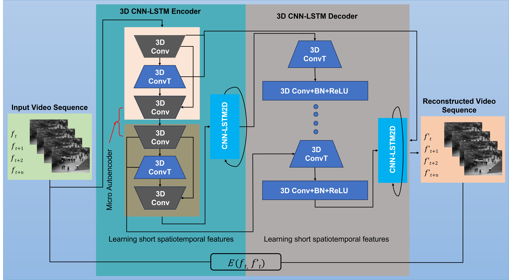
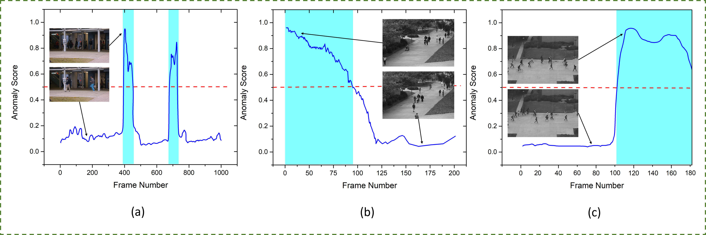

<div align="center">

# Video Anomaly Detection Utilizing Efficient Spatiotemporal Feature Fusion

[](https://www.python.org/downloads/)
[](https://tensorflow.org/)
[](https://keras.io/)
[](LICENSE)
[](https://github.com/sareerulamin/Video-Anomaly-Detection)

This repository contains the official implementation of the paper: **"Video Anomaly Detection Utilizing Efficient Spatiotemporal Feature Fusion with 3D Convolutions and Long Short-Term Memory Modules"** by *Sareer Ul Amin, Bumsoo Kim, Yonghoon Jung, Sanghyun Seo, Sangoh Park* - *Advanced Intelligent Systems, 2024*

[Paper DOI:](https://doi.org/10.1002/aisy.202300706) | [Dataset](#2-download-datasets)


</div>

---


## Overview

Surveillance cameras produce vast amounts of video data, posing a challenge for analysts due to the infrequent occurrence of unusual events. To address this, intelligent surveillance systems leverage AI and computer vision to automatically detect anomalies. This study proposes an innovative method combining 3D convolutions and long short-term memory (LSTM) modules to capture spatiotemporal features in video data. Notably, a structured coarse-level feature fusion mechanism enhances generalization and mitigates the issue of vanishing gradients. Unlike traditional convolutional neural networks, the approach employs depth-wise feature stacking, reducing computational complexity and enhancing the architecture. Additionally, it integrates microautoencoder blocks for downsampling, eliminates the computational load of ConvLSTM2D layers, and employs frequent feature concatenation blocks during upsampling to preserve temporal information. Integrating a Conv-LSTM module at the down- and upsampling stages enhances the model's ability to capture short- and long-term temporal features, resulting in a 42-layer network while maintaining robust performance. Experimental results demonstrate significant reductions in false alarms and improved accuracy compared to contemporary methods, with enhancements of 2.7%, 0.6%, and 3.4% on the UCSDPed1, UCSDPed2, and Avenue datasets, respectively.

### Model Architecture

<div align="center">



*Figure: The proposed method integrates micro-AE blocks during downsampling, eliminates the computational load of ConvLSTM2D layers, and introduces frequent feature concatenation blocks during upsampling to retain temporal information. The incorporation of a Conv-LSTM module at the end of the down- and upsampling stages enhances the model's capacity to capture long–short-term temporal features.*

</div>


---

## 1. Installation (Anaconda with Python 3.8+ recommended)

### Clone the Repository

```bash
git clone https://github.com/sareerulamin/Video-Anomaly-Detection.git
cd Video-Anomaly-Detection
```

### Create Virtual Environment

```bash
# Using conda (recommended)
conda create -n anomaly python=3.8
conda activate anomaly

# Or using venv
python -m venv venv
# Windows
venv\Scripts\activate
# Linux/Mac
source venv/bin/activate
```

### Install Dependencies

```bash
pip install -r requirements.txt
```

**requirements.txt:**
```
tensorflow>=2.4.0
keras>=2.4.0
opencv-python>=4.5.0
numpy>=1.19.0
matplotlib>=3.3.0
scikit-learn>=0.24.0
Pillow>=8.0.0
```

---

## 2. Download Datasets

Download and organize the datasets in the following structure:

| Dataset | Description | Download Link |
|---------|-------------|---------------|
| **CUHK Avenue** | 16 training + 21 testing videos | [Avenue Dataset](http://www.cse.cuhk.edu.hk/leojia/projects/detectabnormal/dataset.html) |
| **UCSD Ped1** | 34 training + 36 testing clips | [UCSD Dataset](http://www.svcl.ucsd.edu/projects/anomaly/dataset.html) |
| **UCSD Ped2** | 16 training + 12 testing clips | [UCSD Dataset](http://www.svcl.ucsd.edu/projects/anomaly/dataset.html) |

### Dataset Structure

```
Video-Anomaly-Detection/
├── Avenue_Dataset/
│   ├── normal/              # Normal training videos (.mp4, .avi)
│   └── abnormal/            # Abnormal test videos (.mp4, .avi)
├── Avenue/
│   ├── train_set/
│   │   ├── normal/
│   │   └── abnormal/
│   └── val_set/
│       ├── normal/
│       └── abnormal/
├── ped1/
│   ├── train_set/
│   │   ├── normal/
│   │   └── abnormal/
│   └── val_set/
└── Ped2/
    ├── train_set/
    │   ├── normal/
    │   └── abnormal/
    └── val_set/
        ├── normal/
        └── abnormal/
```

---

## 3. Testing on Saved Models

### Quick Test with Pre-trained Model

```python
from keras.models import load_model
import numpy as np
import cv2

# Load pre-trained model
model = load_model('anomaly_mdel.h5')

# Load and preprocess test video
# ... (see model.ipynb for full implementation)

# Make predictions
reconstructions = model.predict(test_video)

# Calculate anomaly score (reconstruction error)
anomaly_score = np.mean(np.abs(test_video - reconstructions), axis=(1,2,3,4))
```

### Using Jupyter Notebook

```bash
jupyter notebook model.ipynb
```

Run all cells to:
1. Load and visualize data
2. Test the pre-trained model
3. Generate reconstruction visualizations
4. Plot ROC curves and anomaly scores

---

## 4. Training from Scratch

### 4.1 Configure Training Parameters

Edit the following parameters in `model.ipynb`:

```python
# Data parameters
video_folder = 'Avenue_Dataset/normal'  # Path to training videos
num_frames = 4                           # Frames per clip
frame_height = 240                       # Frame height
frame_width = 320                        # Frame width

# Model parameters
input_shape = (num_frames, frame_height, frame_width, 1)
dp = 0.3                                 # Dropout rate

# Training parameters
batch_size = 1
epochs = 5
validation_split = 0.3
```

### 4.2 Run Training

```python
# Create model
model = Models._sEnDec_cnn_lstm(input_shape, dp)

# Compile
model.compile(optimizer=Adadelta(), loss=MeanSquaredError())

# Train
model.fit(train_video, train_video, 
          batch_size=batch_size, 
          epochs=epochs, 
          validation_split=validation_split,
          verbose=1)

# Save model
model.save("anomaly_mdel.h5")
```

### 4.3 Hyperparameters

| Parameter | Default | Description |
|-- Experimental Results

### Benchmark Performance (Frame-Level AUC)

The proposed 3D CNN-LSTM architecture achieves **state-of-the-art** results on standard benchmarks:

| Dataset | AUC (%) | Improvement |
|---------|---------|-------------|
| **UCSD Ped1** | **94.5%** | +2.7% over prior methods |
| **UCSD Ped2** | **96.8%** | +0.6% over prior methods |
| **CUHK Avenue** | **93.0%** | +3.4% over prior methods |

### Comparison with State-of-the-Art Methods

| Method | Ped1 | Ped2 | Avenue |
|--------|------|------|--------|
| Lu et al. | 91.8 | – | 80.9 |
| Zhou et al. | 83.5 | 94.9 | 86.1 |
| Tang et al. | 82.6 | 96.2 | 83.7 |
| Wen et al. | 83.1 | 95.4 | 85.1 |
| Yao et al. | 84.5 | 95.9 | 85.9 |
| **Proposed Method** | **94.5** | **96.8** | **93.0** |

### Model Efficiency

| Model | Parameters (M) | Size (MB) | Time/Seq (ms) |
|-------|----------------|-----------|---------------|
| VGG19 + BD-LSTM | 143.00 | 605.50 | 220 |
| Inception V3 + BD-LSTM | 23.00 | 148.50 | 180 |
| ResNet-50 + BD-LSTM | 25.00 | 143.00 | 200 |
| **Proposed Method** | **0.224** | **2.83** | **160** |


### Anomaly Score Visualization

<div align="center">



*Figure: a) The graph shows the abnormality score on test video 04 in the Avenue dataset. b) The graph displays the abnormality score on test video 23 in the UCSDPed1 dataset. c) The graph depicts the abnormality score on test video 02 in the UCSDPed2 dataset. The graph represents the ground truth anomalous frames in cyan. To make it more understandable, we normalized the abnormality scores for each video within the range of 0–1. The graph shown above displays that as abnormalities occur, the score of the abnormalities also increases.*

</div>

### Sample Detection Results

<div align="center">


*Figure: Sample frames from the datasets showing normal and anomalous events detected by the proposed method.*

</div>

For detailed experimental validation and ablation studies, refer to the [full paper](Advanced%20Intelligent%20Systems%20-%202024%20-%20Ul%20Amin%20-%20Video%20Anomaly%20Detection%20Utilizing%20Efficient%20Spatiotemporal%20Feature%20Fusion.pdf).

---


### Reconstruction Comparison

The model reconstructs normal frames accurately while struggling with anomalous content:

| Original Frames | Reconstructed Frames | Reconstruction Error |
|-----------------|---------------------|---------------------|
| Normal activity | Low error |  Normal |
| Anomalous activity | High error |  Anomaly Detected |

### Evaluation Metrics

```python
# Calculate ROC curve
from sklearn.metrics import roc_curve, auc

fpr, tpr, thresholds = roc_curve(labels, anomaly_scores)
roc_auc = auc(fpr, tpr)

# Plot results
plt.plot(fpr, tpr, label=f'ROC curve (AUC = {roc_auc:.2f})')
```

---

## Project Structure

```
Video-Anomaly-Detection/
├── model.ipynb              #  Main notebook (training & evaluation)
├── anomaly_mdel.h5          #  Pre-trained model weights
├── requirements.txt         #  Python dependencies
├── README.md                #  This file
├── results/                  #  Images and diagrams
│   └── framework.png
│   └── ascore.png
│   └── samples_images.png
├── Avenue_Dataset/          #  Avenue dataset
├── Avenue/                  #  Avenue dataset (alternate)
├── ped1/                    #  UCSD Ped1 dataset
└── Ped2/                    #  UCSD Ped2 dataset
```


---

## License

This project is licensed under the MIT License - see the [LICENSE](LICENSE) file for details.

---

## Acknowledgements

- [CUHK Avenue Dataset](http://www.cse.cuhk.edu.hk/leojia/projects/detectabnormal/dataset.html)
- [UCSD Anomaly Detection Dataset](http://www.svcl.ucsd.edu/projects/anomaly/dataset.html)
- TensorFlow and Keras teams

---
## Citation

If you find this work useful in your research, please cite:

```bibtex
@article{ulamin2024video,
  title={Video Anomaly Detection Utilizing Efficient Spatiotemporal Feature Fusion with 3D Convolutions and Long Short-Term Memory Modules},
  author={Ul Amin, Sareer and Kim, Bumsoo and Jung, Yonghoon and Seo, Sanghyun and Park, Sangoh},
  journal={Advanced Intelligent Systems},
  volume={6},
  number={7},
  pages={2300706},
  year={2024},
  publisher={Wiley},
  doi={10.1002/aisy.202300706}
}
```
<div align="center">

**⭐ Star this repository if you find it helpful!**

[](https://github.com/sareerulamin/Video-Anomaly-Detection)
[](https://github.com/sareerulamin/Video-Anomaly-Detection/fork)

**Questions?** Open an [Issue](https://github.com/sareerulamin/Video-Anomaly-Detection/issues)

</div>
